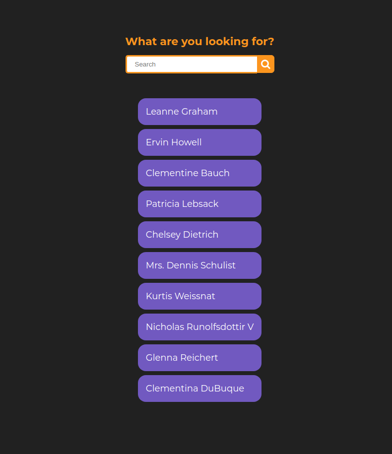
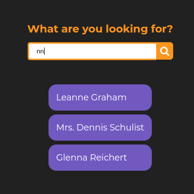

# Debounce do zero ⏰ ✋


## Visão geral 🤔

Foi criado uma página html para fazer o estudo de como implementar a lógica do debounce com JavaScript. O usuário digita um nome no input, após um certo tempo dele ter parado de digitar, a aplicação faz uma requisição para buscar os dados. Dessa forma, é evitado que seja realizada uma busca a cada clique do usuário.

## 🖼️ Imagens da Aplicação

### Sem Filtro

<p align="center">
  
</p>

### Com Filtro

<p align="center">
  
</p>

---

## Função Debounce

```js
const debounceEvent = 
  (fn, wait = 1000, time) => 
  (...args) =>
  clearTimeout(
    time,
    time = setTimeout(() => fn(...args), wait)
  );

function handleKeyUp(event) {
  filterUsers(event.target.value)
  .then(users => {
    const usersName = users.map(user => user.name);
    cleanList();
    usersName.forEach(addUserNameToList);
  });
}
```

## 📚 Referências

- [Video 📹](https://www.youtube.com/watch?v=OyTPNNIy3pc)


## 📝 Licença

Acesse [MIT](https://github.com/vitorsemidio-dev/til-debounce-code-drops/blob/master/LICENSE) para mais informações.
